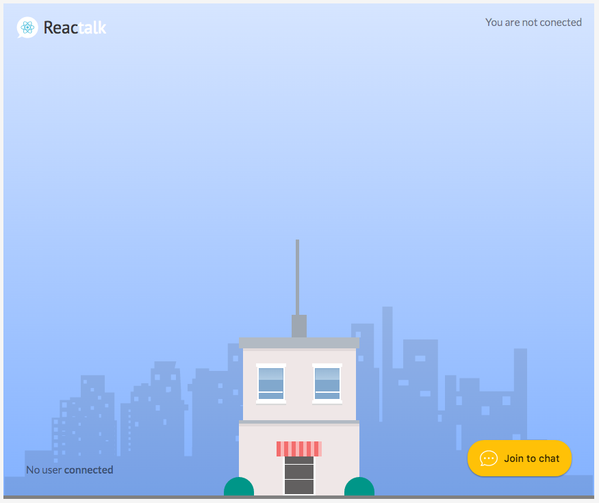
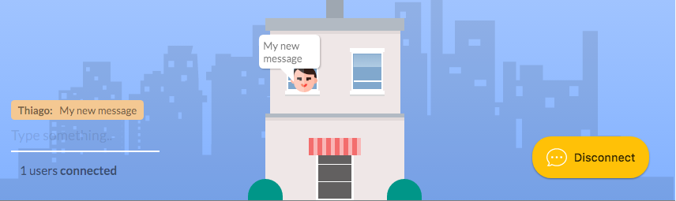

# React Realtime Chat



This is a sample React app which demonstrates how to handle real-time interactions, this application uses the `socket.io` lib to enable real-time bi-directional event-based communication.

The server side is a simple node application that runs as a server for the socket and manages the users and messages.
The concept under this sample is trying to demonstrate how React with WebSockets could be a powerful combination to make awesome applications.

About Socket.IO

[webside](http://socket.io/)
Socket.IO enables real-time bi-directional event-based communication.
It works on every platform, browser or device, focusing equally on reliability and speed.

## Screenshot


## What it does?
This sample must provide the following functionalities:
 - A user can connect to chat
 - For each user, the UI will mount a new window space on the tower
 - For each interaction chat, the window with the user will show a bubble chat with the message wrote.

## Possible / Future implementations (contribute)
 - Demo
 - Chat rooms (towers) implementation
 - Google login
 - Sounds
 - More animations
 - Firebase database integration
 - Chat history
 - Emojicons

 ---


 # Get started

 *Run the server first*

 ```
 $ git clone https://github.com/thiagoterleski/react-realtime-tower-server
 $ cd react-realtime-tower-server
 $ yarn install
 $ node app.js
 ```

 *Run the application*
 ```
 $ git clone https://github.com/thiagoterleski/realtime-tower
 $ cd react-marvel-catalog
 $ yarn install
 $ yarn start
 ```

 This sample was made with *Create React App* [(more information)](https://github.com/facebookincubator/create-react-app/issues/new) see the doc for requirements.
